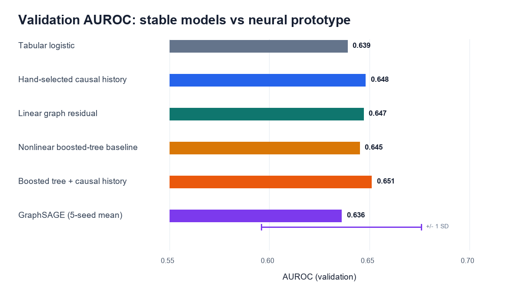
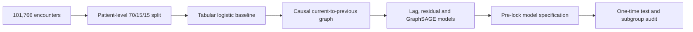

# Graph Diabetes Digital Twin Prototype

A leakage-aware research prototype for representing repeated diabetes hospital encounters as a causal temporal graph and testing whether observed patient history improves 30-day readmission prediction.

> **Main finding:** prior healthcare utilisation was the strongest tabular signal. Explicit causal history produced a small but paired-bootstrap-supported AUROC gain, including against a nonlinear boosted-tree comparator, while average-precision and calibration gains remained negligible. A GraphSAGE prototype was initialization-sensitive and was not selected as the final model.



## Research question

Can a directed encounter graph add predictive information beyond a conventional tabular model without leaking future encounters, patient identity, or test-set information?

## Study design



- **Prediction time:** discharge from the index encounter.
- **Outcome:** readmission in fewer than 30 days.
- **Primary cohort:** excludes death/hospice discharge dispositions.
- **Split unit:** patient, preventing the same patient from crossing partitions.
- **Graph direction:** current encounter → previous observed encounter.
- **Evaluation:** validation for development; test used after locking the stable temporal model.

## Key results

### Data and graph

| Quantity | Result |
|---|---:|
| Raw encounters | 101,766 |
| Unique patients | 71,518 |
| Patients with multiple encounters | 16,773 (23.45%) |
| Primary-cohort graph nodes | 99,343 |
| Directed causal-history edges | 29,353 |
| Nodes with observed history | ~30% |

### Validation model comparison

| Model | AUROC | Average precision | Interpretation |
|---|---:|---:|---|
| Tabular logistic | 0.639 | 0.198 | Transparent reference |
| Hand-selected causal history | 0.648 | 0.200 | Strongest stable specification |
| Linear graph residual | 0.647 | 0.201 | Similar gain with full previous-node message |
| Nonlinear boosted-tree baseline | 0.645 | 0.201 | Stronger current-encounter comparator |
| Nonlinear boosted tree + causal history | 0.651 | 0.205 | History gain persists nonlinearly |
| GraphSAGE, primary seed | 0.655 | 0.212 | Promising single run |
| GraphSAGE, five-seed mean | 0.636 ± 0.040 | 0.202 ± 0.013 | Too unstable to select |

The model specification was locked before its test evaluation. The selected temporal model achieved:

- **Test AUROC:** 0.633 (patient-bootstrap 95% CI 0.615–0.649)
- **Test average precision:** 0.206 (95% CI 0.175–0.236)
- **Tabular-to-temporal AUROC change:** +0.48 percentage points
- **Paired patient-bootstrap AUROC-change CI:** +0.04 to +0.90 percentage points
- **Paired probability of an AUROC improvement:** 99.0%
- **Mean predicted risk / observed rate:** 11.8% / 11.6%
- **Calibration slope:** 0.840; highest-risk decile was overpredicted


## Why a graph—and what the experiment showed

Permutation importance identified prior-year inpatient visits as the dominant tabular signal. Removing outpatient, emergency, and inpatient utilisation counts reduced validation AUROC from 0.639 to 0.595. This justified testing an explicit longitudinal representation.

A structured history ablation sharpened that interpretation. Without the three utilisation counts, adding only a history-availability indicator raised validation AUROC from 0.595 to 0.631; adding history count and previous-encounter detail reached 0.638. Edge existence and trajectory length therefore carry much of the signal, while previous-node clinical detail contributes a smaller increment. A fixed histogram-gradient-boosting baseline reached 0.645, and the same causal-history augmentation reached 0.651, showing that the history signal was not merely a linear-model artifact.

The causal graph nevertheless added limited out-of-sample value. This distinction is central to the project:

> Longitudinal history is important, but that does not imply a graph neural network will automatically outperform a well-designed tabular representation.

## Leakage controls

1. Patients are assigned to train, validation, or test before graph construction.
2. Current encounters can read only previous encounters; edges are never symmetrized.
3. `encounter_id` is excluded from model inputs and used only as an ordering surrogate.
4. Previous-node outcome labels are never used as features.
5. Imputation, scaling, category grouping, and encoders are fitted on training data only.
6. The test set is evaluated after selecting the stable temporal specification.
7. Raw data, split assignments, graph files, model artifacts, and row-level predictions remain local.

## Subgroup and calibration checks

The global validation-selected threshold behaved differently when longitudinal history was available: test sensitivity/specificity were 95.4%/10.0% among encounters with history and 40.4%/70.9% among first-observed encounters. This is a warning against treating one threshold as clinically portable.


Subgroup results are descriptive. They do not establish fairness, causality, or clinical validity.

## Next research step toward a medical digital twin

This repository is a leakage-aware longitudinal prediction precursor, not a complete digital twin. The next methodological step is a treatment-conditioned state-transition model of the form `p(next patient state | observed trajectory, current state, treatment)`, using heterogeneous encounter, diagnosis, medication, laboratory and molecular-data relations. Such a study would compare tabular summaries, sequence models and heterogeneous graph models under the same inductive patient split, evaluate multi-step trajectory error and uncertainty, and keep predictive treatment conditioning distinct from causal treatment-effect estimation.

## Reproduce the analysis

Download the UCI files as described in [`data/README.md`](data/README.md), then create the environment:

```powershell
conda env create -f environment.yml
conda activate graph-diabetes-twin
```

Run the pipeline in order:

```powershell
python -m src.audit_data
python -m src.build_data_dictionary
python -m src.create_splits
python -m src.train_baseline
python -m src.analyze_baseline
python -m src.run_history_ablation
python -m src.run_history_structure_ablation
python -m src.build_temporal_graph
python -m src.train_temporal_baseline
python -m src.train_strong_tabular
python -m src.train_graphsage_prototype
python -m src.train_graph_residual
python -m src.evaluate_locked_temporal_model
python -m src.analyze_calibration_subgroups
python -m unittest discover
```

## Repository guide

```text
data/       Source instructions; raw and derived row-level data remain local
docs/       Graph specification, Chinese learning guide, application material
reports/    Aggregate audits, model comparisons, and figures
src/        Reproducible data, modelling, graph, and evaluation modules
tests/      Reserved for automated regression tests
```

- Start with the Chinese companion: [`docs/PROJECT_GUIDE_ZH.md`](docs/PROJECT_GUIDE_ZH.md)
- Review graph safety: [`docs/GRAPH_DESIGN.md`](docs/GRAPH_DESIGN.md)
- Read the locked test report: [`reports/locked_temporal_test.md`](reports/locked_temporal_test.md)
- Review the strong nonlinear comparison: [`reports/strong_tabular_results.md`](reports/strong_tabular_results.md)
- Review what the graph history actually contributes: [`reports/history_structure_ablation.md`](reports/history_structure_ablation.md)
- Review calibration/subgroups: [`reports/calibration_subgroups.md`](reports/calibration_subgroups.md)
- Reuse application wording: [`docs/APPLICATION_MATERIALS.md`](docs/APPLICATION_MATERIALS.md)

## Limitations

- The dataset is retrospective and covers 1999–2008 care across heterogeneous hospitals.
- No explicit timestamps are available; numeric encounter ID is only a chronology surrogate.
- Only ~30% of eligible encounter nodes have an observed prior encounter.
- No hospital identifier is available for site-level external validation.
- GraphSAGE stability was inadequate, and the selected temporal gain was small.
- The nonlinear comparator was evaluated on validation only and was not promoted to a new final model after test inspection.
- Subgroup estimates lack external validation and should not guide care.
- This prototype is not a medical device or clinical decision-support system.

## Dataset and responsible use

The project uses **Diabetes 130-US Hospitals for Years 1999–2008** from the UCI Machine Learning Repository under CC BY 4.0:

> Clore, J., Cios, K., DeShazo, J., & Strack, B. (2014). Diabetes 130-US Hospitals for Years 1999–2008. UCI Machine Learning Repository. https://doi.org/10.24432/C5230J

The public dataset is de-identified but contains sensitive demographic and clinical attributes. Do not attempt re-identification or publish row-level extracts.
