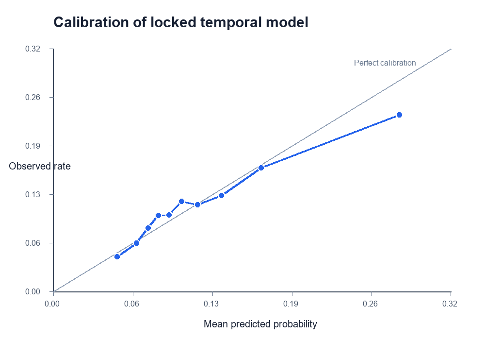
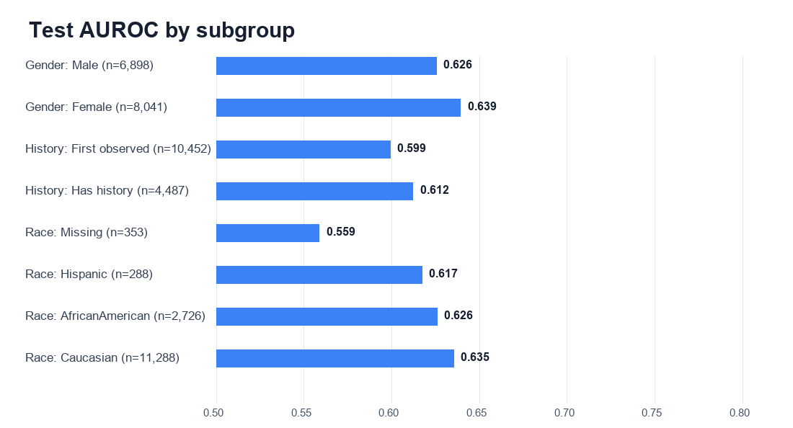

# Calibration and subgroup audit

## Calibration

- Mean predicted risk: **0.118**.
- Observed 30-day readmission rate: **0.116**.
- Calibration intercept: **-0.330** (ideal 0).
- Calibration slope: **0.840** (ideal 1).
- Decile expected calibration error: **0.012** (lower is better).

| Risk decile | N | Mean predicted | Observed rate |
|---|---:|---:|---:|
| 1 | 1,494 | 0.052 | 0.046 |
| 2 | 1,494 | 0.067 | 0.064 |
| 3 | 1,494 | 0.077 | 0.084 |
| 4 | 1,494 | 0.085 | 0.101 |
| 5 | 1,494 | 0.094 | 0.102 |
| 6 | 1,493 | 0.104 | 0.119 |
| 7 | 1,494 | 0.117 | 0.115 |
| 8 | 1,494 | 0.136 | 0.127 |
| 9 | 1,494 | 0.168 | 0.164 |
| 10 | 1,494 | 0.280 | 0.234 |

## Subgroup performance at the global validation-selected threshold (0.100)

Groups with fewer than 100 encounters, fewer than 20 positives, or fewer than 20 negatives are omitted from metric tables. Results are descriptive and do not establish fairness or explain the source of differences.

| Family | Group | N | Positives | Prevalence | AUROC | Avg precision | Sensitivity | Specificity |
|---|---|---:|---:|---:|---:|---:|---:|---:|
| Race | AfricanAmerican | 2,726 | 312 | 0.114 | 0.626 | 0.186 | 0.612 | 0.553 |
| Race | Caucasian | 11,288 | 1,330 | 0.118 | 0.635 | 0.213 | 0.661 | 0.518 |
| Race | Hispanic | 288 | 33 | 0.115 | 0.617 | 0.309 | 0.485 | 0.659 |
| Race | Missing | 353 | 28 | 0.079 | 0.559 | 0.106 | 0.286 | 0.760 |
| Gender | Female | 8,041 | 949 | 0.118 | 0.639 | 0.215 | 0.659 | 0.530 |
| Gender | Male | 6,898 | 780 | 0.113 | 0.626 | 0.196 | 0.618 | 0.543 |
| Age | [20-30) | 292 | 59 | 0.202 | 0.804 | 0.535 | 0.847 | 0.575 |
| Age | [30-40) | 590 | 74 | 0.125 | 0.715 | 0.254 | 0.703 | 0.599 |
| Age | [40-50) | 1,372 | 153 | 0.112 | 0.700 | 0.281 | 0.588 | 0.682 |
| Age | [50-60) | 2,624 | 272 | 0.104 | 0.656 | 0.191 | 0.482 | 0.720 |
| Age | [60-70) | 3,210 | 385 | 0.120 | 0.634 | 0.206 | 0.634 | 0.552 |
| Age | [70-80) | 3,799 | 416 | 0.110 | 0.574 | 0.147 | 0.651 | 0.451 |
| Age | [80-90) | 2,546 | 318 | 0.125 | 0.603 | 0.195 | 0.758 | 0.352 |
| Age | [90-100) | 398 | 44 | 0.111 | 0.526 | 0.122 | 0.568 | 0.429 |
| History | First observed | 10,452 | 987 | 0.094 | 0.599 | 0.138 | 0.404 | 0.709 |
| History | Has history | 4,487 | 742 | 0.165 | 0.612 | 0.276 | 0.954 | 0.100 |

## Interpretation

1. Calibration assesses probability accuracy, not ranking. A useful risk model needs both.
2. Average precision changes with outcome prevalence, so direct subgroup comparisons require care.
3. A single threshold can produce very different sensitivity and specificity across groups, especially when history availability changes baseline risk.
4. These retrospective subgroup estimates have no external validation and should not be used to claim clinical equity.
